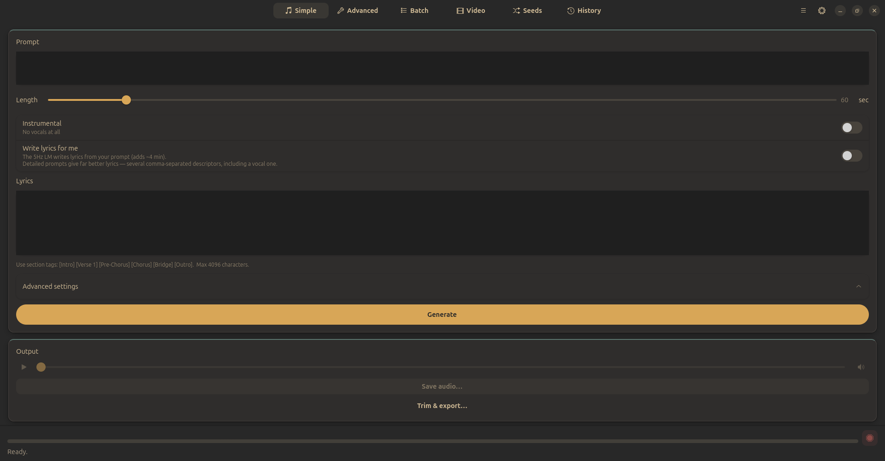
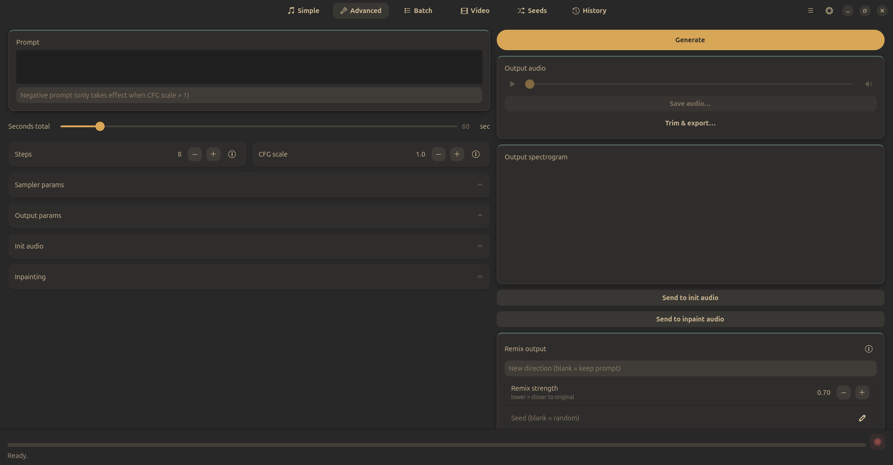
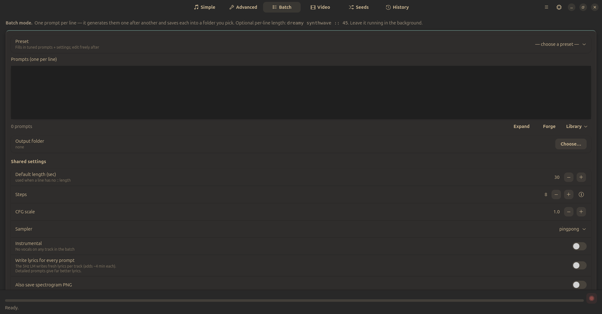

<div align="center">


# Steppy

**Offline AI music generation with sung lyrics up to 3+ Minutes — on CPU, no GPU required.**

A GTK4 / libadwaita desktop app for Linux, built on [ACE-Step 1.5](https://github.com/ace-step/ACE-Step-1.5).


</div>

---

## What it does

Type a prompt like:

```
chillstep, ethereal core synthwave, dreamy breathy female vocals,
lush atmospheric pads, vintage analog synths, gated reverb
```

…and Steppy generates a complete song with structured, sung lyrics. You can write
the lyrics yourself, let the bundled language model write them from your prompt, or
turn vocals off entirely for instrumentals.

Everything runs **locally and offline**. The model, the Python runtime and every
dependency ship inside the package. No API keys, no network, no GPU.

## Features

- **Auto-written lyrics** — a 0.6B language model turns your style prompt into verses and a chorus
- **Bring your own lyrics** — section tags (`[Verse 1]`, `[Chorus]`, `[Bridge]`…) up to 4096 characters
- **Instrumental mode**
- **Batch** — one prompt per line, optional `prompt :: 180` duration override, renders a folder of songs
- **Video export** — pair a track with a still image
- **Themes**, bundled OFL fonts, tray icon, optional PIN lock
- 48 kHz stereo output, 10 s to 10 min per track

## Demo

**[▶ steppy_demo.wav](steppy_demo.wav)** — 60 seconds, 48 kHz stereo, generated
on CPU. Lyrics written by the bundled 0.6B model from the style prompt alone.

*(GitHub opens a player on that page — READMEs can't embed audio inline.)*

## Screenshots

**Simple** — a prompt, a length, and Generate.



**Advanced** — steps, CFG, sampler and output params, init audio, inpainting,
spectrogram and remix.



**Batch** — one prompt per line with optional `:: length` overrides, rendered
into a folder while you do something else.



## Requirements

| | |
|---|---|
| OS | Linux with GTK4 + libadwaita |
| CPU | x86-64. AVX2 strongly recommended (see *Performance*) |
| RAM | 16 GB minimum, 32 GB for the standard build |
| Disk | ~9 GB installed |
| GPU | **not required, not used** |

System packages (everything else is bundled):

```
python3 python3-gi gir1.2-gtk-4.0 gir1.2-adw-1
gstreamer1.0-plugins-base gstreamer1.0-plugins-good
```

## Install

Download a `.deb` from [HuggingFace](https://huggingface.co/jegly/steppy/tree/main) —


```sh
sudo dpkg -i steppy_1.0.0-16gb_amd64.deb    # 16GB machines
sudo dpkg -i steppy_1.0.0-32gb_amd64.deb    # 32GB machines
```

**Which build?**

| | 16gb | 32gb |
|---|---|---|
| DiT precision | bfloat16 + int8 | full |
| peak RAM | ~8 GB | ~12 GB |
| max track length | 3 min | 10 min |
| memory guard | `MemoryHigh=9G` | `MemoryHigh=20G` |

The 16 GB build also runs fine on 32 GB machines 

## Performance

Steppy runs entirely on CPU, and CPU music generation is slow. Measured throughput
is **~15× realtime** on a Ivy Bridge i5 with no AVX2 — a 2-minute track takes
about 30 minutes there.

Modern CPUs with AVX2/AVX-512 should are substantially faster.

Auto-written lyrics add roughly 4 minutes per track on top.

**Prompt detail matters more than you'd expect.** Four-word prompts produce
incoherent lyrics; seven or eight comma-separated descriptors — including a vocal
descriptor — produce good ones. This is the single biggest lever on output quality.

## Building from source

```sh
./build_deb.sh 16gb        # or 32gb
```

The build needs three things it does not carry:

| variable | default | what |
|---|---|---|
| `BASE_RUNTIME` | `../runtime` | relocatable CPython 3.12 |
| `ACESTEP_SRC` | `~/acestep-test/ACE-Step-1.5` | ACE-Step repo + `checkpoints/` |
| `ACESTEP_SP` | `~/acestep-test/venv/lib/python3.12/site-packages` | ACE-Step's deps (torch 2.10 CPU) |

Model weights (~7.3 GB) download from HuggingFace on first setup:

```sh
python -c "from huggingface_hub import snapshot_download as d; \
  d('ACE-Step/Ace-Step1.5', local_dir='checkpoints', \
    ignore_patterns=['acestep-5Hz-lm-1.7B/*'])"
python -c "from huggingface_hub import snapshot_download as d; \
  d('ACE-Step/acestep-5Hz-lm-0.6B', local_dir='checkpoints/acestep-5Hz-lm-0.6B')"
```

The 1.7B language model is deliberately excluded — it's 3.45 GB and took over
20 minutes to write a single set of lyrics on CPU without finishing. The 0.6B
model with a detailed prompt is strictly better here.

## Architecture

```
gui.py              GTK4 front-end (system python)
   │ newline-delimited JSON over a subprocess pipe
   ▼
worker_acestep.py   resident worker (bundled python + torch)
   │
   ├── 5Hz LM       short-lived subprocess — writes lyrics, then exits
   └── ACE-Step DiT lazy-loaded, stays resident between renders
```

The language model runs as a **subprocess that exits** rather than staying
resident. Holding it alongside the DiT peaks at ~10.3 GB, which on a 16 GB
desktop crosses `systemd-oomd`'s pressure threshold and gets your browser killed.
A subprocess returns every byte on exit.

The launcher handles three hardware quirks:

```sh
grep -q avx2 /proc/cpuinfo || export DNNL_MAX_CPU_ISA=AVX
export ACESTEP_GENERATION_TIMEOUT=14400
systemd-run --user --scope -p MemoryHigh=9G ...
```

1. **Pre-AVX2 CPUs** hit an illegal instruction inside oneDNN on some tensor
   shapes — a 30 s render works while a 60 s one dies with SIGILL. The clamp is
   conditional, so modern CPUs keep full AVX2/AVX-512 dispatch.
2. **ACE-Step's generation timeout defaults to 600 s**, sized for GPUs. On CPU
   anything past ~40 s of audio aborts mid-render.
3. **`MemoryHigh`** throttles a heavy render into reclaim instead of letting
   `systemd-oomd` pick a victim elsewhere in your session.


## Licence

Steppy is MIT licensed — see [LICENSE](LICENSE).

It bundles third-party components, all permissively licensed. ACE-Step 1.5 and
its weights are **MIT**; see [THIRD-PARTY-LICENSES.md](THIRD-PARTY-LICENSES.md)
for the complete list and notices.

## Credits

Built on [ACE-Step 1.5](https://github.com/ace-step/ACE-Step-1.5) by the ACE-Step
team. Text encoding by [Qwen3-Embedding](https://huggingface.co/Qwen/Qwen3-Embedding-0.6B).
